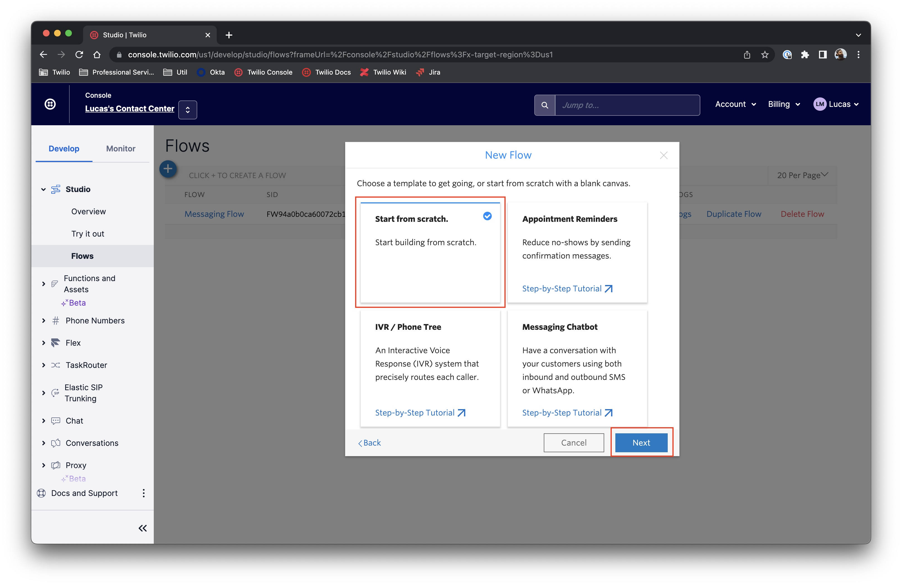

# Flex Business Hours Helper/Handler

This repository contains a sample code for handling calls outside of business hours on Twilio Studio and Twilio Flex, allowing you to define custom logic to accept or reject calls between your own defined business hours/schedule. Also, it supports redirecting calls to external contacts that might be able to handle these calls as well as sending these calls to a voicemail queue on Twilio Flex.

## Requirements

- Node 14+
- NPM 6.14+
- [Twilio CLI 3.4+](https://www.twilio.com/docs/twilio-cli/quickstart#install-twilio-cli)
- [Serverless Plugin for Twilio CLI](https://www.twilio.com/docs/twilio-cli/plugins#available-plugins)

## Setup

### Cloning the repository

First things first, you need to clone this repository using the following command:

```
$ git clone https://github.com/devsdmf/flex-handle-business-hours.git
$ cd flex-handle-business-hours
```

### Installing dependencies

Now, we need to install the dependencies of our project, just typing the following command (assuming you are on the root of the repository):

```
$ npm install
```

### Environment Variables

In order to setup the environment variables, first, make a copy of the `.env.sample` file called `.env`:

```
$ cp .env.sample .env
```

Now, open the `.env` file on your prefered text/code editor and fill out the params according to the list below:

- *ACCOUNT_SID*: Your account's SID, you can find this information on your Twilio Console's dashboard
- *AUTH_TOKEN*: Your account's authentication token, you can find this information on your Twilio Console's dashboard
- *DEFAULT_CALLER_ID*: One of your Twilio phone numbers that you want to use to place the outbound calls in +E.164 format.
- *DEFAULT_FLOW_SID*: The Twilio Studio Flow SID that we are going to create in the next steps, you can leave it empty for now.

### Deploying the functions

After setting up the environment variables, we are able to continue with the deployment of these functions on your environment. Type the following command on your project root folder:

```
$ twilio serverless:deploy
```

*IMPORTANT*: Make sure that you have setup a profile on your CLI prior to run this command.

When you finish the deployment, you will get an output like the following example, save it in a safe place:

```

Deploying functions & assets to the Twilio Runtime

Username        SKXXXXXXXXXXXXXXXXXXXXXXXXXXXXXXXX
Password        SHXXXXXXXXXXXXXXXXXXXXXXXXXXXXXX
Service SID     ZSXXXXXXXXXXXXXXXXXXXXXXXXXXXXXXXX
Environment     dev
Root Directory  /path/to/flex-handle-business-hours
Dependencies    @twilio/runtime-handler, luxon, twilio
Env Variables   DEFAULT_CALLER_ID, DEFAULT_FLOW_SID
Runtime         node14

✔ Serverless project successfully deployed

Deployment Details
Domain: flex-handle-business-hours-XXXX-dev.twil.io
Service:
   flex-handle-business-hours (ZSXXXXXXXXXXXXXXXXXXXXXXXXXXXXXXXX)
Environment:
   dev (ZEXXXXXXXXXXXXXXXXXXXXXXXXXXXXXXXX)
Build SID:
   ZBXXXXXXXXXXXXXXXXXXXXXXXXXXXXXXXX
Runtime:
   node14
View Live Logs:
   https://www.twilio.com/console/functions/editor/ZSXXXXXXXXXXXXXXXXXXXXXXXXXXXXXXXX/environment/ZEXXXXXXXXXXXXXXXXXXXXXXXXXXXXXXXX
Functions:
   [private] https://flex-handle-business-hours-XXXX-dev.twil.io/config
   [private] https://flex-handle-business-hours-XXXX-dev.twil.io/helpers
   [protected] https://flex-handle-business-hours-XXXX-dev.twil.io/check-business-hours
   [protected] https://flex-handle-business-hours-XXXX-dev.twil.io/get-on-call-contact
   [protected] https://flex-handle-business-hours-XXXX-dev.twil.io/redirect-call-outcome
   [protected] https://flex-handle-business-hours-XXXX-dev.twil.io/redirect-call-recording-callback
   [protected] https://flex-handle-business-hours-XXXX-dev.twil.io/redirect-call-to-external-contact
```

### Setting up Studio Flows

There's many ways to implement the business hours checking on your Twilio project, but in this project, we provide you with two sample implementations. The first one leverage the Twilio Studio's *Connect Call To* widget to connect the two parties, but this approach gives you less flexibility in terms of recording the call between the two parties as well how to handle post-conversation and error handling while trying to contact the On Call contact. The second approach uses a Twilio Function to connect the two parties using a TwiML object and allows you the specify custom handlers to save the recording as well to manage post-call interactions.

#### Alternative 1 - Placing Outbound Calls using Studio

On the *Twilio Console*, go to [Studio](https://console.twilio.com/us1/develop/studio/flows?frameUrl=%2Fconsole%2Fstudio%2Fflows%3Fx-target-region%3Dus1) and create a new Flow by hitting the plus sign (+) icon on the top of the list. A modal window will open, fill the *Flow Name* with a name of your choice and press _Next_.


On the next screen, select *Start from scratch* and click on _Next_ button.



Now, on the *Studio Flow Editor*, click on the *Trigger* widget and on the _Flow Configuration_ (right sidebar) scroll down and click on *Show Flow JSON* to open the *Flow Definition* window.


In the `/resources` folder, copy the contents of the `voice-ivr-with-business-hours-1.json`, paste on the *Flow Definition* window replacing the whole content, then hit the *Save* button.


Now, in the *Editor* screen you need to setup the following widget with your own environment resources:

* **CheckBusinessHours**
	* Service: Select the deployed service (flex-handle-business-hours)
	* Environment: Select the service environment
	* Function: Select the `/check-business-hours` function
* **FetchOnCallContact**
	* Service: Select the deployed service (flex-handle-business-hours)
	* Environment: Select the service environment
	* Function: Select the `/get-on-call-contact`
* **SendCallToAgents**
	* Workflow: Select your Flex workflow
	* Task Channel: Select the _Voice_ task channel (or any voice-based channel of your project)
* **SendToVoicemail**
	* Workflow: Select your Flex workflow
	* Task Channel: Select a Task Channel to receive and/or handle voicemails

Save your Flow and publish the changes. Remember to update your Twilio Phone Number handler to use the new Studio Flow.

#### Alternative 2 - Placing Outbound Calls using Functions

To use this alternative, follow the same steps as described in *Alternative 1*, but using the `voice-ivr-business-hours-2.json` for the *Studio Flow Definition*. In the Flow configuration part, set up the widgets with the following attributes:

* **CheckBusinessHours**
	* Service: Select the deployed service (flex-handle-business-hours)
	* Environment: Select the service environment
	* Function: Select the `/check-business-hours` function
* **RedirectCallToExternalContact**
  * URL: Fill with the URL of the `/redirect-call-to-external-contact` function
* **SendCallToAgents**
	* Workflow: Select your Flex workflow
	* Task Channel: Select the _Voice_ task channel (or any voice-based channel of your project)
* **SendToVoicemail**
	* Workflow: Select your Flex workflow
	* Task Channel: Select a Task Channel to receive and/or handle voicemails

Save your Flow and publish the changes. Remember to update your Twilio Phone Number handler to use the new Studio Flow.

## The implementation

### Defining your business hours

The function `check-business-hours` is responsible to return to the Studio Flow if the call is within the working hours. The default implementation uses the [Luxon](https://moment.github.io/luxon/) library to handle the DateTime definitions and uses a 9am to 7pm, Monday to Friday for working hours. You can also mix the date and time validation with agent availability using TaskRouter API, it is up to you how to define this implementation.

### On Call Contacts

On the `/functions` folder we have a `helpers.private.js` file that contains a function to retrieve the _On Call_ contacts. By default, this function has a hard-coded list of contacts, but you can define these contacts on an external file or even fetch from an API.

On the `get-on-call-contact` function, you can filter and sort these contacts with a logic of your choice, for example, you can filter contacts by the hour of the day, but the day of the week and so on. 

### Redirect call to external contact

The function `redirect-call-to-external-contact` is used on the second implementation example of this project, that uses a TwiML to connect the two parties of the call. Using this approach you have more flexibility on how to handle the call to this external agent, as well, record this call and receiving the recording when the call is complete. Use this function to implement a logic to select an *On Call* contact and connect the two callers.

## Disclaimer

This software is to be considered "sample code", a Type B Deliverable, and is delivered "as-is" to the user. Twilio bears no responsibility to support the use or implementation of this software.

## License

This project is licensed under the  [MIT license](LICENSE) , that means that it is free to use, copy and modify for your own intents.
